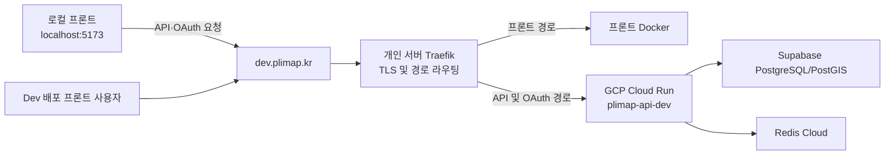
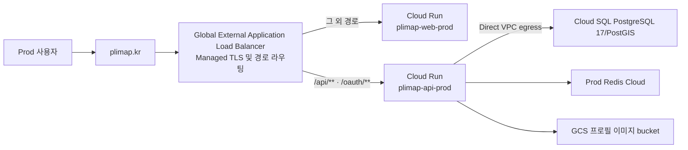

# Deployment Guide

## Overview

이 문서는 PLIMAP 백엔드의 local, dev, prod 환경별 실행 위치와 인프라 구성을 설명합니다.

## 환경별 구성

| 구분 | local | dev | prod |
| --- | --- | --- | --- |
| 상태 | 개발자 PC에서 사용 | 배포 자동화 및 `dev.plimap.kr` 공개 경로 구성 완료 | GCP 리소스·LB 골격 완료, Secret·최초 release·DNS 전환 대기 |
| Spring profile | `local` | `dev` | `prod` |
| 애플리케이션 실행 위치 | 개발자 PC | GCP Cloud Run Gen2 (`asia-northeast3`) | GCP Cloud Run Gen2 (`asia-northeast3`) |
| PostgreSQL/PostGIS | Docker Compose | Supabase Transaction Pooler | Cloud SQL PostgreSQL 17/PostGIS (3.5.2 target) |
| Redis | Docker Compose | Redis Cloud (`ap-northeast-2`) | Prod 전용 Redis Cloud |
| 외부 진입점 | `localhost:8080` | 개인 서버의 Traefik | GCP Global External Application Load Balancer (`plimap.kr`) |
| 프론트엔드 | `localhost:5173` 기준 | 로컬 개발 서버와 개인 서버 Docker가 Dev 백엔드 공유 | Cloud Run `plimap-web-prod` |
| Swagger/OpenAPI | 활성화 | 활성화 | 기본 비활성화 |
| 배포 방식 | Gradle로 직접 실행 | GitHub Actions 자동 배포 또는 PowerShell 스크립트 | `main` CI 성공 후 GitHub Environment 수동 승인 |

Prod 공개 도메인은 `plimap.kr`입니다. Cloud SQL, GCS, Redis, VPC, API·프론트 Cloud Run bootstrap과 External Application Load Balancer 골격은 구성되었습니다. 최초 애플리케이션 release, Kakao Secret 입력, 가비아 DNS 전환과 Managed TLS 활성화가 남아 있습니다.

## 배포 구성요소와 역할

| 구성요소 | 적용 환경 | 역할 |
| --- | --- | --- |
| Docker Compose | local | PostGIS와 Redis를 개발자 PC에 실행 |
| Dockerfile | dev, prod | Java 21 애플리케이션을 빌드하고 non-root 사용자로 실행하는 컨테이너 이미지 생성 |
| GitHub Actions | CI, dev/prod CD | Gradle 검증, dev 자동 배포, Prod 승인 배포 실행 |
| Workload Identity Federation | dev/prod CD | 장기 GCP 서비스 계정 키 없이 승인된 GitHub Actions가 GCP에 인증 |
| Artifact Registry | dev, prod | commit SHA image를 저장하고 Prod에는 immutable digest로 배포 |
| Cloud Run | dev, prod | Spring Boot API와 Prod SPA 컨테이너 실행, 신규 revision 검증과 revision 트래픽 처리 |
| Secret Manager | dev, prod | 환경별로 분리된 DB, Redis, JWT, OAuth, 외부 API 자격 증명 관리 |
| Supabase | dev | PostgreSQL/PostGIS 데이터베이스 제공 |
| Redis Cloud | dev, prod | 환경별로 분리된 공유 Redis 제공 |
| GCS | prod | 공개 프로필 이미지 객체 저장, runtime service account가 업로드·삭제 |
| 가비아 DNS | dev, prod | Dev 서브도메인은 Traefik, Prod 루트 도메인은 고정 LB IPv4와 연결 |
| Traefik | dev | Dev TLS 종료와 경로 기반 리버스 프록시 처리 |
| External Application Load Balancer | prod | Managed TLS, HTTP→HTTPS, 프론트·API 경로 기반 라우팅 |
| Frontend Cloud Run | prod | `plimap-web-prod`에서 SPA 정적 파일 제공 |

## 공통 애플리케이션 런타임

- Java 21과 Spring Boot 애플리케이션을 하나의 컨테이너 이미지로 빌드합니다.
- Docker 이미지는 JDK builder와 JRE runtime을 분리한 multi-stage build를 사용합니다.
- 컨테이너는 non-root 사용자로 실행하며 기본 포트는 `8080`입니다.
- Hibernate는 스키마를 자동 생성하지 않고 검증만 수행합니다.
- Flyway가 애플리케이션 시작 시 데이터베이스 Migration을 적용합니다.
- Actuator는 상태 확인 endpoint만 공개하고 상세 컴포넌트 정보는 노출하지 않습니다.
- 프록시 환경에서는 전달된 host와 protocol 정보를 Spring이 인식하도록 forwarded header 처리를 사용합니다.

---

## local 환경

local 환경은 백엔드 개발자가 외부 배포 인프라 없이 기능을 개발하고 검증하기 위한 구성입니다.

```text
Spring Boot (개발자 PC, :8080)
├─ PostGIS (Docker Compose, :5432)
└─ Redis (Docker Compose, :6379)
```

- `compose.yml`이 PostGIS와 Redis를 실행하며 두 서비스 모두 localhost에만 port를 공개합니다.
- PostgreSQL과 Redis 데이터는 Docker volume에 보존됩니다.
- `application-local.yml`은 SQL 로그와 OAuth 상세 로그, Swagger/OpenAPI를 활성화합니다.
- 로컬 쿠키는 HTTP 개발 환경에서 사용할 수 있도록 secure 정책을 비활성화합니다.
- 프론트엔드는 `http://localhost:5173`, 백엔드는 `http://localhost:8080`을 기준으로 연동합니다.
- Swagger UI는 `http://localhost:8080/swagger-ui/index.html`에서 확인합니다.

구체적인 실행 명령은 [README의 로컬 실행 방법](../README.md#로컬-실행-방법), DB와 volume 관리 방법은 [Database Guide](DATABASE.md)를 참고합니다.

---

## dev 환경

### 전체 요청 흐름



Dev 백엔드는 배포된 Dev 프론트와 프론트 개발자의 로컬 개발 서버가 함께 사용합니다.

- Dev 배포 프론트는 동일 host의 상대 경로 `/api`, `/oauth`를 사용합니다.
- 로컬 프론트는 API Base URL과 OAuth 시작 주소로 `https://dev.plimap.kr`을 사용합니다.
- credential CORS는 `https://dev.plimap.kr`, `http://localhost:5173`, `https://pr-*.plimap.kr`, 그리고 HTTP/HTTPS `192.168.0.0/16` Origin(개발용 포트 포함)을 명시적으로 허용하며, OAuth 프론트 allowlist는 exact-origin과 승인된 preview 패턴을 사용합니다.
- 프론트의 OAuth 시작 요청은 `frontendOrigin`을 전달하며, 백엔드는 allowlist 검증 후 요청별 로그인 완료 주소로 사용합니다.

### 로컬 프론트 인증 호출 계약

로컬 프론트는 OAuth 시작 요청과 API 요청에 다음 계약을 사용합니다.

```javascript
const backendOrigin = "https://dev.plimap.kr";

// provider callback은 dev.plimap.kr로 유지되고, 로그인 완료 후 localhost로 돌아옵니다.
window.location.assign(
  `${backendOrigin}/oauth/authorization/google?frontendOrigin=${encodeURIComponent(window.location.origin)}`,
);

const csrfResponse = await fetch(`${backendOrigin}/api/v1/auth/csrf`, {
  credentials: "include",
});
const { result } = await csrfResponse.json();

await fetch(`${backendOrigin}/api/v1/example`, {
  method: "POST",
  credentials: "include",
  headers: {
    "Content-Type": "application/json",
    "X-XSRF-TOKEN": result.token,
  },
  body: JSON.stringify({}),
});
```

모든 인증 API 요청은 `credentials: "include"`를 사용합니다. `localhost`와 `dev.plimap.kr`은 cross-site 관계이므로 브라우저가 서드파티 쿠키를 차단하면 `SameSite=None`이어도 인증 쿠키가 전송되지 않을 수 있습니다. 로컬 E2E는 `dev.plimap.kr`의 서드파티 쿠키를 허용한 지원 브라우저에서 검증하고, 쿠키 차단 환경까지 공식 지원해야 한다면 별도의 same-site 개발 도메인 또는 로컬 callback/proxy 전략을 추가로 설계합니다.

Cloud Run 원본 URL은 운영상 Traefik upstream과 배포 직후 직접 검증에 사용하지만, 현재 dev 배포 정책상 Traefik을 거치지 않고도 외부에서 직접 접근할 수 있습니다.

### DNS와 TLS

- 가비아의 `dev` A 레코드와 `*` A 레코드는 개인 서버의 동일한 고정 공인 IPv4를 가리킵니다.
- `dev.plimap.kr`은 현재 사용하는 실제 dev 서비스 host입니다.
- `*.plimap.kr`은 미등록 서브도메인을 같은 서버로 보내기 위한 DNS 규칙이며 실제 요청 주소가 아닙니다.
- 루트 도메인 `plimap.kr`은 와일드카드에 포함되지 않으며 prod 구성 시 별도로 연결합니다.
- TLS 인증서는 현재 `dev.plimap.kr` 단일 인증서만 사용합니다.
- Traefik에 정의되지 않은 서브도메인은 기본 404로 처리합니다.

### Traefik 라우팅

| 공개 경로 | 목적지 |
| --- | --- |
| `/api/**` | dev Cloud Run |
| `/oauth/**` | dev Cloud Run |
| `/swagger-ui/**` | dev Cloud Run |
| `/v3/api-docs/**` | dev Cloud Run |
| 그 외 경로 | 프론트 Docker |

Traefik은 공개 경로의 접두사를 제거하지 않고 그대로 Cloud Run에 전달합니다. 백엔드 경로는 프론트 SPA fallback보다 높은 우선순위를 사용하며 요청의 method, path, query, body, cookie와 응답의 `Set-Cookie`, `Location` header를 유지합니다.

Cloud Run은 외부에서 접속한 `dev.plimap.kr` host와 HTTPS protocol을 인식해야 합니다. Traefik은 client 정보와 함께 원래 host, protocol, port를 forwarded header로 전달합니다. Cloud Run upstream 연결에서는 Cloud Run 서비스 host를 TLS server name으로 사용합니다.

### Cloud Run 정책

| 항목 | dev 설정 |
| --- | --- |
| GCP project | `plimap` |
| Region | `asia-northeast3` |
| Service | `plimap-api-dev` |
| Execution environment | Gen2 |
| CPU / Memory | 1 vCPU / 512 MiB |
| Concurrency | 40 |
| Request timeout | 60초 |
| Minimum / Maximum instances | 0 / 2 |
| Ingress | all |
| Authentication | 공개 접근 허용 |
| Container port | 8080 |

Cloud Run은 프론트와 API 연동을 위해 `ingress=all`, 인증 없는 공개 접근을 유지합니다. 일반 API, OAuth와 health 경로는 원본 URL에서도 기존 동작을 유지하지만, Swagger UI와 OpenAPI 경로는 forwarded host가 `dev.plimap.kr`인 요청에만 응답합니다. Cloud Run 원본 host의 동일 경로는 `404 Not Found`를 반환합니다.

**SSE(알림 실시간 구독)와 Request timeout**: `GET /api/v1/notifications/subscribe`는 요청 하나를 계속 열어두는 방식이라 Request timeout(60초)의 영향을 그대로 받습니다. `--concurrency=40`, `--max-instances=2`로 동시 처리 가능한 요청이 최대 80개뿐이라, 연결을 오래 유지하는 대신 서버가 약 50초마다(Cloud Run이 강제 종료하기 전에) 스트림을 정상 종료하고 클라이언트(`EventSource`)의 자동 재연결에 맡기는 방식을 택했습니다. Request timeout을 늘리는 대신 이 방식을 쓴 것은, 접속자가 늘어날 때 SSE 연결이 동시 처리 슬롯을 오래 붙잡아 일반 API 요청을 밀어내는 상황을 피하기 위해서입니다.

Cloud Run 원본 URL은 고정 문서값으로 관리하지 않고 서비스 상태에서 조회합니다.

```powershell
gcloud run services describe plimap-api-dev `
  --project=plimap `
  --region=asia-northeast3 `
  --format="value(status.url)"
```

### dev 배포 흐름

자동 배포는 다음 순서로 진행합니다.

1. `develop`에 반영된 커밋의 CI가 Gradle build와 test를 수행합니다.
2. CI 성공 후 `Deploy Dev` 워크플로가 동일 커밋을 checkout합니다.
3. GitHub Actions가 Workload Identity Federation으로 GCP에 인증합니다.
4. Docker 이미지를 빌드해 Artifact Registry에 commit SHA tag로 push합니다.
5. `deploy-dev.ps1`이 Cloud Run의 새 revision을 배포합니다.
6. Cloud Run 원본 URL의 health와 문서 경로 차단을 확인하고, `dev.plimap.kr`에서 Swagger UI와 OpenAPI 실제 콘텐츠를 검증합니다.

`workflow_dispatch`를 사용한 수동 배포는 선택한 ref의 commit SHA를 직접 배포하며 선행 CI 성공을 강제하지 않습니다. 따라서 수동 실행 전 해당 commit의 CI 결과를 확인해야 합니다. 이후 이미지 빌드, Cloud Run 배포와 검증 절차는 자동 배포와 동일합니다.

로컬에서 동일한 배포 스크립트를 실행하는 방법은 [GCP 스크립트 README](../scripts/gcp/README.md)를 참고합니다.

### dev profile 특성

- Supabase Transaction Pooler를 사용하며 pooler 호환성을 위한 JDBC 설정을 적용합니다.
- Redis Cloud의 TLS endpoint를 사용합니다.
- Swagger UI와 OpenAPI 문서는 `dev.plimap.kr`에서만 제공하고 Cloud Run 원본 host에는 `404`를 반환합니다.
- Dev 테스트 토큰은 Secret Manager에서 주입한 별도 발급 키가 일치하고 대상 회원이 활성 상태일 때만 발급합니다.
- Dev 테스트 토큰은 일반 액세스 권한을 가지며 유효기간은 1시간입니다. Local에서는 발급 키를 생략할 수 있고 Prod에는 테스트 토큰 API가 생성되지 않습니다.
- OAuth Provider callback은 `dev.plimap.kr`에 고정하고, 로그인 완료 후 이동 주소는 요청별 `frontendOrigin`에 따라 Dev 배포 프론트 또는 로컬 프론트로 결정합니다.
- Dev 인증 쿠키는 cross-site 로컬 프론트 요청을 위해 `Secure`, `HttpOnly`, `SameSite=None`을 사용합니다.
- 로컬 프론트는 `GET /api/v1/auth/csrf` 응답 본문의 토큰을 상태 변경 요청의 `X-XSRF-TOKEN` 헤더로 전달합니다.
- secure cookie와 forwarded header 처리는 HTTPS reverse proxy 구성을 기준으로 적용합니다.

---

## prod 환경

Prod 영구 데이터 리소스, API·프론트 Cloud Run bootstrap, 최소 구성의 Global External Application Load Balancer는 생성되었습니다. 실제 애플리케이션 revision과 루트 DNS 트래픽은 아직 활성화하지 않았습니다.

### 목표 요청 흐름



Prod는 개인 서버 Traefik을 사용하지 않습니다. 고정 IPv4 `8.233.213.169`의 Global External Application Load Balancer가 TLS를 종료하고 두 serverless NEG를 통해 프론트와 API Cloud Run으로 전달합니다.

URL map은 `/api`, `/api/*`, `/oauth`, `/oauth/*`만 `plimap-api-prod`로 보내고 나머지를 `plimap-web-prod`로 보냅니다. 프론트 Nginx는 `/swagger-ui`, `/v3/api-docs`, `/actuator` 예약 경로에 SPA fallback을 적용하지 않고 `404`를 반환합니다.

두 Cloud Run 서비스는 `internal-and-cloud-load-balancing` ingress와 기본 `run.app` URL 비활성화를 유지합니다. 인증 없는 Invoker는 LB의 serverless NEG 호출에 필요하지만 LB를 우회한 인터넷 직접 진입은 Cloud Run ingress에서 차단합니다.

### Cloud SQL

| 항목 | Prod 설정 |
| --- | --- |
| Edition / machine | Enterprise / `db-custom-1-3840` |
| Database | PostgreSQL 17 / PostGIS 3.5.2 installed |
| Region / availability | `asia-northeast3` / 단일 Zone |
| Storage | SSD 10GB, 자동 증가 |
| Protection | 자동 백업, PITR, 삭제 방지 활성화 |
| Network | Private IP, Cloud Run Direct VPC egress, connector enforcement `NOT_REQUIRED` |
| HikariCP | max pool 8, min idle 0, connection timeout 5초 |
| 최대 애플리케이션 연결 | Cloud Run 3개 × pool 8 = 24 |

Flyway applies migrations when the application starts. Live Cloud SQL PostgreSQL 18.4 checks returned `POSTGIS_AVAILABLE=false`, so PostgreSQL 17 is the approved Prod major version. The final PostgreSQL 17 gate passed on 2026-08-06 with PostGIS 3.5.2, all 18 Flyway migrations, runtime CRUD and least-privilege checks. The permanent `plimap-prod-postgres` instance now uses the same baseline. A 0% application revision can still start during deploy health checks before user traffic switches, so every migration must remain backward compatible between the existing and new revisions.

The runtime JDBC connection is a direct TCP connection to the Cloud SQL private IP through Direct VPC egress. Keep Cloud SQL connector enforcement at `NOT_REQUIRED`; `REQUIRED` rejects direct database connections and is only compatible when the application uses the Cloud SQL Auth Proxy or a Cloud SQL Language Connector.

초기에는 이 시작 시 Migration 방식을 유지하고, 대량 backfill이나 파괴적 변경이 필요해지면 별도 Cloud Run Job 또는 승인된 운영 작업으로 분리합니다. Revision rollback은 이미 적용된 DB Migration을 되돌리지 않습니다.

> Prod bootstrap note: after the PostgreSQL 17 validation gate passes, activate PostGIS once in the target database with an administrator account before the first Cloud Run revision starts. The application then runs Flyway with the dedicated `FLYWAY_USERNAME` and `FLYWAY_PASSWORD` account; that account must not receive `cloudsqlsuperuser`.
>
> `V1__init_schema.sql` keeps `CREATE EXTENSION IF NOT EXISTS postgis` for fresh Local, Dev, and Test databases.
>
> Live PG18 checks on 2026-08-06 returned `POSTGIS_AVAILABLE=false` on both Enterprise and Enterprise Plus temporary instances. The accepted PG17 gate returned a newer default PostGIS 3.6.0, confirmed 3.5.2 was available, installed that exact version, and passed the full suite. The permanent instance was then created with PostGIS 3.5.2 instead of following the mutable default.

### Cloud Run

| 항목 | Prod 설정 |
| --- | --- |
| Project / region / service | `plimap` / `asia-northeast3` / `plimap-api-prod` |
| Execution environment | Gen2 |
| CPU / Memory | 1 vCPU / 1 GiB |
| Billing | Request-based (`cpu-throttling`) |
| Concurrency / timeout | 40 / 60초 |
| Service minimum / maximum instances | 0 / 3 |
| Theoretical request slots | 최대 120 |
| Ingress / authentication | `internal-and-cloud-load-balancing` / serverless NEG 호출을 위한 공개 Invoker |
| Egress | Direct VPC `private-ranges-only` |
| Swagger/OpenAPI | Prod profile 기본 비활성화, LB 공개 경로에서는 프론트 Nginx가 명시적 `404` 반환 |

Prod deployer는 서비스 단위 `roles/run.developer`만 사용하므로 인프라 관리자가 `scripts/gcp/bootstrap-prod-cloud-run.ps1`을 먼저 실행합니다. Cloud Run은 새 서비스의 첫 revision에 `--no-traffic`을 허용하지 않으므로 Google 공식 sample bootstrap revision만 100%로 두되 기본 `run.app` URL과 외부 직접 ingress를 차단합니다. 이때 `allUsers:roles/run.invoker`와 Prod deployer의 서비스 단위 권한을 한 번 설정하며, 반복 배포는 IAM을 변경하지 않습니다. 첫 실제 애플리케이션 revision부터 `--no-traffic`과 deploy health check로 기동한 뒤 Ready·digest를 검증하고 트래픽만 전환합니다.

SSE 구독은 Dev와 동일하게 약 50초 후 정상 종료하고 클라이언트 재연결을 사용합니다. SSE 연결도 concurrency 슬롯과 실행 시간을 점유하므로 초기 사용자 수를 넘어서면 Cloud Run instance, 요청 수와 비용을 함께 모니터링합니다.

### GCS 프로필 이미지

Prod profile은 Application Default Credentials로 GCS Java client를 사용합니다. DB에는 `members/{memberId}/{uuid}.webp` object key만 저장하고 응답 URL은 `https://storage.googleapis.com/{bucket}/{objectKey}` 형식으로 생성합니다.

- 새 이미지 업로드 성공 후 DB object key를 갱신하고, DB 반영이 완료된 뒤 이전 이미지를 삭제합니다.
- DB 반영에 실패하면 방금 업로드한 신규 객체를 보상 삭제하고 원래 DB 오류를 반환합니다. 보상 삭제 실패는 원래 오류를 덮지 않고 경고 로그로 남깁니다.
- Runtime service account에는 bucket 범위 `roles/storage.objectUser`만 부여합니다.
- 프로필 이미지는 공개 데이터로 취급하되 목록 조회는 막기 위해 `allUsers`에는 객체 GET 전용 `roles/storage.legacyObjectReader`만 부여합니다.
- Uniform bucket-level access를 사용하고 Object Versioning과 7일 Soft Delete는 비활성화합니다.
- 버킷 용량은 사전 할당하지 않으며 실제 객체 수와 저장 용량을 모니터링합니다.

리소스 생성 예시는 다음과 같습니다. 실제 bucket 이름은 GitHub `production` Environment의 `PROD_GCS_BUCKET`과 일치시킵니다.

```powershell
gcloud storage buckets create "gs://<prod-gcs-bucket>" `
  --project=plimap `
  --location=asia-northeast3 `
  --default-storage-class=STANDARD `
  --uniform-bucket-level-access

gcloud storage buckets update "gs://<prod-gcs-bucket>" `
  --no-versioning `
  --clear-soft-delete

gcloud storage buckets add-iam-policy-binding "gs://<prod-gcs-bucket>" `
  --member="serviceAccount:plimap-api-prod@plimap.iam.gserviceaccount.com" `
  --role="roles/storage.objectUser"

gcloud storage buckets add-iam-policy-binding "gs://<prod-gcs-bucket>" `
  --member=allUsers `
  --role="roles/storage.legacyObjectReader"
```

Public Access Prevention 조직 정책이 강제되어 있다면 공개 URL 방식은 사용할 수 없습니다. 이 경우 정책을 임의로 우회하지 말고 signed URL 또는 프록시 제공 방식으로 별도 설계를 변경합니다.

### 승인 배포 흐름

1. `main` push에 대한 `PLIMAP CI`가 Gradle build와 test, PowerShell 구문 검증을 수행합니다.
2. 성공한 CI의 정확한 commit SHA로 `Deploy Prod`의 비보호 `prepare` Job이 시작됩니다.
3. `deploy` Job은 GitHub `production` Environment에서 대기하며 승인 전에는 Environment Variable, GCP OIDC 권한과 운영 리소스에 접근하지 않습니다.
4. 필수 승인자가 Actions의 **Review deployments → Approve and deploy**를 선택합니다.
5. 승인된 Job이 정확한 commit SHA checkout을 OCI revision label과 함께 image로 빌드·push하고, 원격 digest와 revision label을 검증해 immutable image를 확정합니다.
6. 입력 리소스와 기존 서비스의 기본 URL 비활성 bootstrap 또는 단일 revision 100% 트래픽 상태, 공개 Invoker IAM을 확인하고 각 Prod Secret의 `ENABLED` 숫자 버전을 고정합니다.
7. 공개 traffic tag 없이 `--no-traffic`과 deploy health check로 신규 revision을 시작하고, 제어 영역의 상태 반영 지연을 고려한 제한된 재시도로 Ready 상태와 실제 image digest를 확인합니다.
8. 검증된 revision으로 트래픽을 100% 전환하고 실제 서비스 트래픽이 단일 revision 100%로 수렴하는지 확인합니다. 기본 `run.app` URL은 계속 비활성화합니다.
9. 서비스 ingress와 기본 URL 비활성 상태를 재검증합니다. DNS와 Managed TLS가 활성화된 뒤 `PROD_PUBLIC_SMOKE_ENABLED=true`이면 `plimap.kr`의 프론트, CSRF 응답·cookie, Google OAuth 3xx·`Location`과 문서·Actuator 차단도 검증합니다.
10. 실패 시 현재 트래픽 상태를 다시 조회하고 직전 revision으로 100% 복구한 뒤 트래픽 수렴과 LB 전용 상태를 재검증합니다.
11. Commit, image digest, Secret ID·숫자 버전, 이전·신규 revision, 내부·공개 검증과 rollback 결과를 Actions Summary에 기록합니다.

0% 신규 revision은 외부 호출용 tag URL을 갖지 않고 기본 URL도 계속 비활성화하지만, deploy health check 과정에서 시작되므로 Flyway가 사용자 트래픽 전환 전에 운영 DB를 변경할 수 있습니다. 최초 배포 실패 시 공식 sample bootstrap revision으로 100% 복구합니다. 최초 배포에서는 Migration 호환성과 Actions Summary를 특히 확인하고, 두 애플리케이션 revision이 준비된 뒤에만 가비아 루트 A record를 LB 고정 IP로 전환합니다.

### 외부 인프라 준비 체크리스트

- Cloud SQL PostgreSQL 17에서 PostGIS available/default/installed version과 Flyway·CRUD·권한 검증 완료 후 SSD 10GB 자동 증가, 자동 backup/PITR와 삭제 방지, connector enforcement `NOT_REQUIRED` 구성
- Prod VPC/subnet과 Cloud SQL private IP 연결, Cloud Run Direct VPC egress 권한 구성
- `bootstrap-prod-cloud-run.ps1`로 기본 URL이 비활성화된 공식 sample bootstrap 서비스, 공개 Invoker와 Prod deployer 서비스 단위 `roles/run.developer` 구성
- GCS bucket, 공개 읽기와 runtime 쓰기·삭제 IAM, versioning/soft delete 비활성화 확인
- Prod 전용 Redis Cloud database와 TLS URL 준비
- `plimap-api-prod` runtime service account에 Prod Secret별 accessor와 Prod bucket `objectUser` 권한 구성
- GitHub deployer에 Cloud Run·Artifact Registry·service account 사용·Direct VPC 설정 권한과 Secret version metadata 조회 권한만 구성
- `scripts/gcp/SECRETS.md`의 GitHub Environment Variable과 Prod Secret의 `ENABLED` 버전 입력
- Google/Kakao Prod OAuth client callback 등록
- Global External Application Load Balancer, serverless NEG, Managed TLS와 `/api/**`, `/oauth/**` URL map 구성 후 가비아 루트 A record 연결
- GCP 접근 로그, 오류율·요청량·지연 시간 지표, 비용 예산 알림 확인

### Prod 공개 경로 smoke test

두 Cloud Run 애플리케이션 revision, 가비아 DNS와 Managed TLS가 준비되면 `PROD_PUBLIC_SMOKE_ENABLED=true`로 바꾸고 `plimap.kr`의 실제 사용자 경로를 확인합니다.

- `https://plimap.kr/api/v1/auth/csrf`가 예상한 API 응답과 CSRF cookie를 반환하는지 확인합니다.
- `https://plimap.kr/oauth/authorization/google?frontendOrigin=https%3A%2F%2Fplimap.kr`가 3xx를 반환하고 `Location`이 Google authorization endpoint와 `https://plimap.kr/oauth/callback/google` callback을 포함하는지 확인합니다.
- `/api/**`, `/oauth/**`가 `plimap-api-prod`로 전달되고 다른 프론트 경로는 `plimap-web-prod`로 전달되는지 확인합니다.
- `/swagger-ui/**`, `/v3/api-docs/**`, `/actuator/**`가 Cloud Run으로 전달되지 않고 명시적인 `404`를 반환하는지 확인합니다.
- 로그인 응답의 `Set-Cookie`와 OAuth 응답의 `Location` header가 Load Balancer를 거쳐도 유지되는지 확인합니다.

`deploy-prod.ps1`은 공개 smoke가 활성화되면 위 핵심 경로를 자동 검증합니다. 비활성 상태에서는 Cloud Run deploy health check와 revision Ready·digest, LB 전용 ingress와 기본 URL 비활성 상태만 검증합니다.

## 상태 확인과 배포 검증

| 목적 | 경로 |
| --- | --- |
| 전체 상태 | `/actuator/health` |
| 시작 및 생존 확인 | `/actuator/health/liveness` |
| 트래픽 수신 준비 확인 | `/actuator/health/readiness` |
| Swagger UI | `/swagger-ui/index.html` |
| OpenAPI 문서 | `/v3/api-docs` |

dev 배포 스크립트는 Cloud Run 원본에서 health endpoint의 `200`과 Swagger/OpenAPI 경로의 `404`를 확인합니다. 이어서 `dev.plimap.kr`의 Swagger UI가 실제 HTML을, OpenAPI 경로가 `openapi` 필드를 가진 JSON을 `200`으로 반환하는지 검증합니다. 다음 외부 인프라 검증까지 완료해야 dev 공개 경로 구성이 완료된 것으로 판단합니다.

- `dev.plimap.kr` DNS가 Traefik 서버의 고정 공인 IP를 가리키고 유효한 TLS 인증서를 제공하는지 확인합니다.
- 서버 방화벽이 의도한 공개 포트만 허용하는지 확인합니다.
- 프론트 화면, API, OAuth 시작 경로, Swagger UI와 OpenAPI 문서가 의도한 upstream으로 라우팅되는지 확인합니다.
- Cloud Run 원본 URL의 Swagger UI와 OpenAPI 문서가 `404`인지 확인합니다.
- 로그인 응답의 `Set-Cookie`와 OAuth 응답의 `Location` header가 Traefik을 거쳐도 유지되는지 확인합니다.
- Dev 배포 프론트와 `localhost:5173`에서 Google/Kakao 로그인을 각각 시작해 callback은 `dev.plimap.kr`로 들어오고 로그인 완료 후에는 요청을 시작한 프론트의 `/app/oauth/callback`으로 돌아가는지 검증합니다.
- 두 프론트 Origin에서 credential CORS, 인증 GET, CSRF 보호 상태 변경 요청, 재발급과 로그아웃을 E2E 검증합니다.
- allowlist에 없는 `frontendOrigin`과 CORS Origin이 거부되는지 확인합니다.

## 관련 문서

- 환경변수, Secret Manager 매핑과 값 교체: [SECRETS.md](../scripts/gcp/SECRETS.md)
- Prod 외부 인프라 비용·Apply·검증 실행서: [PROD_INFRASTRUCTURE.md](../scripts/gcp/PROD_INFRASTRUCTURE.md)
- Prod DB 역할과 PostGIS bootstrap: [PROD_DATABASE.md](../scripts/gcp/PROD_DATABASE.md)
- GCP 배포 스크립트 사용법: [scripts/gcp/README.md](../scripts/gcp/README.md)
- 로컬 DB와 Migration: [DATABASE.md](DATABASE.md)
