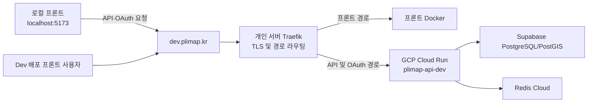

# Deployment Guide

이 문서는 PLIMAP 백엔드의 local, dev, prod 환경별 실행 위치와 인프라 구성을 설명합니다.

## 환경별 구성

| 구분 | local | dev | prod |
| --- | --- | --- | --- |
| 상태 | 개발자 PC에서 사용 | 배포 자동화 구성, 도메인 전환 진행 중 | 목표 구성만 정의, 배포 자동화 미구축 |
| Spring profile | `local` | `dev` | `prod` |
| 애플리케이션 실행 위치 | 개발자 PC | GCP Cloud Run Gen2 (`asia-northeast3`) | GCP Cloud Run 예정 |
| PostgreSQL/PostGIS | Docker Compose | Supabase Transaction Pooler | Cloud SQL for PostgreSQL 예정 |
| Redis | Docker Compose | Redis Cloud (`ap-northeast-2`) | 미정 |
| 외부 진입점 | `localhost:8080` | 개인 서버의 Traefik | `plimap.kr` 사용 예정, 구성 미정 |
| 프론트엔드 | `localhost:5173` 기준 | 로컬 개발 서버와 개인 서버 Docker가 Dev 백엔드 공유 | 구성 미정 |
| Swagger/OpenAPI | 활성화 | 활성화 | 기본 비활성화 |
| 배포 방식 | Gradle로 직접 실행 | GitHub Actions 자동 배포 또는 PowerShell 스크립트 | 미구축 |

prod 항목은 현재 저장소에서 배포 완료를 의미하지 않습니다. `application-prod.yml`에는 Swagger를 기본적으로 비활성화하는 정책만 있으며, prod용 배포 워크플로와 인프라는 아직 추가되지 않았습니다.

## 배포 구성요소와 역할

| 구성요소 | 적용 환경 | 역할 |
| --- | --- | --- |
| Docker Compose | local | PostGIS와 Redis를 개발자 PC에 실행 |
| Dockerfile | dev, 향후 prod | Java 21 애플리케이션을 빌드하고 non-root 사용자로 실행하는 컨테이너 이미지 생성 |
| GitHub Actions | CI, dev CD | Gradle 검증 후 컨테이너 이미지를 빌드하고 dev 배포 실행 |
| Workload Identity Federation | dev CD | 장기 GCP 서비스 계정 키 없이 GitHub Actions가 GCP에 인증 |
| Artifact Registry | dev, 향후 prod | 배포할 컨테이너 이미지 저장 |
| Cloud Run | dev, 향후 prod | Spring Boot API 컨테이너 실행 및 트래픽 처리 |
| Secret Manager | dev, 향후 prod | DB, Redis, JWT, OAuth, 외부 API 자격 증명 관리 |
| Supabase | dev | PostgreSQL/PostGIS 데이터베이스 제공 |
| Redis Cloud | dev | 공유 Redis 제공 |
| 가비아 DNS | dev, 향후 prod | `plimap.kr` 도메인과 공개 서버 주소 연결 |
| Traefik | dev | TLS 종료와 경로 기반 리버스 프록시 처리 |
| 프론트 Docker | dev | SPA 정적 파일과 프론트엔드 애플리케이션 제공 |

## 공통 애플리케이션 런타임

- Java 21과 Spring Boot 애플리케이션을 하나의 컨테이너 이미지로 빌드합니다.
- Docker 이미지는 JDK builder와 JRE runtime을 분리한 multi-stage build를 사용합니다.
- 컨테이너는 non-root 사용자로 실행하며 기본 포트는 `8080`입니다.
- Hibernate는 스키마를 자동 생성하지 않고 검증만 수행합니다.
- Flyway가 애플리케이션 시작 시 데이터베이스 Migration을 적용합니다.
- Actuator는 상태 확인 endpoint만 공개하고 상세 컴포넌트 정보는 노출하지 않습니다.
- 프록시 환경에서는 전달된 host와 protocol 정보를 Spring이 인식하도록 forwarded header 처리를 사용합니다.

## local 환경

local 환경은 백엔드 개발자가 외부 배포 인프라 없이 기능을 개발하고 검증하기 위한 구성입니다.

```text
Spring Boot (개발자 PC, :8080)
├─ PostGIS (Docker Compose, :5432)
└─ Redis (Docker Compose, :6379)
```

- `compose.yml`이 PostGIS와 Redis를 실행하며 두 서비스 모두 localhost에만 port를 공개합니다.
- PostgreSQL과 Redis 데이터는 Docker volume에 보존됩니다.
- `application-local.yml`은 SQL 로그와 OAuth 상세 로그, Swagger/OpenAPI를 활성화합니다.
- 로컬 쿠키는 HTTP 개발 환경에서 사용할 수 있도록 secure 정책을 비활성화합니다.
- 프론트엔드는 `http://localhost:5173`, 백엔드는 `http://localhost:8080`을 기준으로 연동합니다.
- Swagger UI는 `http://localhost:8080/swagger-ui/index.html`에서 확인합니다.

구체적인 실행 명령은 [README의 로컬 실행 방법](../README.md#로컬-실행-방법), DB와 volume 관리 방법은 [Database Guide](DATABASE.md)를 참고합니다.

## dev 환경

### 전체 요청 흐름



Dev 백엔드는 배포된 Dev 프론트와 프론트 개발자의 로컬 개발 서버가 함께 사용합니다.

- Dev 배포 프론트는 동일 host의 상대 경로 `/api`, `/oauth`를 사용합니다.
- 로컬 프론트는 API Base URL과 OAuth 시작 주소로 `https://dev.plimap.kr`을 사용합니다.
- credential CORS와 OAuth 프론트 allowlist는 `https://dev.plimap.kr`, `http://localhost:5173`을 명시적으로 허용합니다.
- 프론트의 OAuth 시작 요청은 `frontendOrigin`을 전달하며, 백엔드는 allowlist 검증 후 요청별 로그인 완료 주소로 사용합니다.

### 로컬 프론트 인증 호출 계약

로컬 프론트는 OAuth 시작 요청과 API 요청에 다음 계약을 사용합니다.

```javascript
const backendOrigin = "https://dev.plimap.kr";

// provider callback은 dev.plimap.kr로 유지되고, 로그인 완료 후 localhost로 돌아옵니다.
window.location.assign(
  `${backendOrigin}/oauth/authorization/google?frontendOrigin=${encodeURIComponent(window.location.origin)}`,
);

const csrfResponse = await fetch(`${backendOrigin}/api/v1/auth/csrf`, {
  credentials: "include",
});
const { result } = await csrfResponse.json();

await fetch(`${backendOrigin}/api/v1/example`, {
  method: "POST",
  credentials: "include",
  headers: {
    "Content-Type": "application/json",
    "X-XSRF-TOKEN": result.token,
  },
  body: JSON.stringify({}),
});
```

모든 인증 API 요청은 `credentials: "include"`를 사용합니다. `localhost`와 `dev.plimap.kr`은 cross-site 관계이므로 브라우저가 서드파티 쿠키를 차단하면 `SameSite=None`이어도 인증 쿠키가 전송되지 않을 수 있습니다. 로컬 E2E는 `dev.plimap.kr`의 서드파티 쿠키를 허용한 지원 브라우저에서 검증하고, 쿠키 차단 환경까지 공식 지원해야 한다면 별도의 same-site 개발 도메인 또는 로컬 callback/proxy 전략을 추가로 설계합니다.

Cloud Run 원본 URL은 운영상 Traefik upstream과 배포 직후 직접 검증에 사용하지만, 현재 dev 배포 정책상 Traefik을 거치지 않고도 외부에서 직접 접근할 수 있습니다.

### DNS와 TLS

- 가비아의 `dev` A 레코드와 `*` A 레코드는 개인 서버의 동일한 고정 공인 IPv4를 가리킵니다.
- `dev.plimap.kr`은 현재 사용하는 실제 dev 서비스 host입니다.
- `*.plimap.kr`은 미등록 서브도메인을 같은 서버로 보내기 위한 DNS 규칙이며 실제 요청 주소가 아닙니다.
- 루트 도메인 `plimap.kr`은 와일드카드에 포함되지 않으며 prod 구성 시 별도로 연결합니다.
- TLS 인증서는 현재 `dev.plimap.kr` 단일 인증서만 사용합니다.
- Traefik에 정의되지 않은 서브도메인은 기본 404로 처리합니다.

### Traefik 라우팅

| 공개 경로 | 목적지 |
| --- | --- |
| `/api/**` | dev Cloud Run |
| `/oauth/**` | dev Cloud Run |
| `/swagger-ui/**` | dev Cloud Run |
| `/v3/api-docs/**` | dev Cloud Run |
| 그 외 경로 | 프론트 Docker |

Traefik은 공개 경로의 접두사를 제거하지 않고 그대로 Cloud Run에 전달합니다. 백엔드 경로는 프론트 SPA fallback보다 높은 우선순위를 사용하며 요청의 method, path, query, body, cookie와 응답의 `Set-Cookie`, `Location` header를 유지합니다.

Cloud Run은 외부에서 접속한 `dev.plimap.kr` host와 HTTPS protocol을 인식해야 합니다. Traefik은 client 정보와 함께 원래 host, protocol, port를 forwarded header로 전달합니다. Cloud Run upstream 연결에서는 Cloud Run 서비스 host를 TLS server name으로 사용합니다.

### Cloud Run 정책

| 항목 | dev 설정 |
| --- | --- |
| GCP project | `plimap` |
| Region | `asia-northeast3` |
| Service | `plimap-api-dev` |
| Execution environment | Gen2 |
| CPU / Memory | 1 vCPU / 512 MiB |
| Concurrency | 40 |
| Request timeout | 60초 |
| Minimum / Maximum instances | 0 / 2 |
| Ingress | all |
| Authentication | 공개 접근 허용 |
| Container port | 8080 |

Cloud Run은 프론트와 API 연동을 위해 `ingress=all`, 인증 없는 공개 접근을 유지합니다. 일반 API, OAuth와 health 경로는 원본 URL에서도 기존 동작을 유지하지만, Swagger UI와 OpenAPI 경로는 forwarded host가 `dev.plimap.kr`인 요청에만 응답합니다. Cloud Run 원본 host의 동일 경로는 `404 Not Found`를 반환합니다.

Cloud Run 원본 URL은 고정 문서값으로 관리하지 않고 서비스 상태에서 조회합니다.

```powershell
gcloud run services describe plimap-api-dev `
  --project=plimap `
  --region=asia-northeast3 `
  --format="value(status.url)"
```

### dev 배포 흐름

1. `develop`에 반영된 커밋의 CI가 Gradle build와 test를 수행합니다.
2. CI 성공 후 `Deploy Dev` 워크플로가 동일 커밋을 checkout합니다.
3. GitHub Actions가 Workload Identity Federation으로 GCP에 인증합니다.
4. Docker 이미지를 빌드해 Artifact Registry에 commit SHA tag로 push합니다.
5. `deploy-dev.ps1`이 Cloud Run의 새 revision을 배포합니다.
6. Cloud Run 원본 URL의 health와 문서 경로 차단을 확인하고, `dev.plimap.kr`에서 Swagger UI와 OpenAPI 실제 콘텐츠를 검증합니다.

로컬에서 동일한 배포 스크립트를 실행하는 방법은 [GCP 스크립트 README](../scripts/gcp/README.md)를 참고합니다.

### dev profile 특성

- Supabase Transaction Pooler를 사용하며 pooler 호환성을 위한 JDBC 설정을 적용합니다.
- Redis Cloud의 TLS endpoint를 사용합니다.
- Swagger UI와 OpenAPI 문서는 `dev.plimap.kr`에서만 제공하고 Cloud Run 원본 host에는 `404`를 반환합니다.
- Dev 테스트 토큰은 Secret Manager에서 주입한 별도 발급 키가 일치하고 대상 회원이 활성 상태일 때만 발급합니다.
- Dev 테스트 토큰은 일반 액세스 권한을 가지며 유효기간은 1시간입니다. Local에서는 발급 키를 생략할 수 있고 Prod에는 테스트 토큰 API가 생성되지 않습니다.
- OAuth Provider callback은 `dev.plimap.kr`에 고정하고, 로그인 완료 후 이동 주소는 요청별 `frontendOrigin`에 따라 Dev 배포 프론트 또는 로컬 프론트로 결정합니다.
- Dev 인증 쿠키는 cross-site 로컬 프론트 요청을 위해 `Secure`, `HttpOnly`, `SameSite=None`을 사용합니다.
- 로컬 프론트는 `GET /api/v1/auth/csrf` 응답 본문의 토큰을 상태 변경 요청의 `X-XSRF-TOKEN` 헤더로 전달합니다.
- secure cookie와 forwarded header 처리는 HTTPS reverse proxy 구성을 기준으로 적용합니다.

## prod 환경

prod는 아직 배포되지 않았으며 다음 항목은 목표 구성입니다.

| 항목 | 목표 또는 현재 결정 |
| --- | --- |
| 공개 도메인 | `plimap.kr` 예정 |
| 애플리케이션 런타임 | dev와 동일한 Docker 이미지 기반 Cloud Run 예정 |
| 데이터베이스 | Cloud SQL for PostgreSQL 예정 |
| Redis | 제공 서비스와 region 미정 |
| Swagger/OpenAPI | `prod` profile에서 기본 비활성화 |
| 프록시와 TLS | 구성 방식 미정 |
| CI/CD | prod 전용 workflow 미구축 |
| 접근 정책과 모니터링 | 배포 전 결정 필요 |

prod 배포 전에는 다음 사항을 별도 작업으로 확정해야 합니다.

1. Cloud Run service, service account, Artifact Registry image 정책
2. Cloud SQL의 PostGIS 지원, network 연결, backup과 Migration 전략
3. Redis 제공 서비스와 장애 대응 정책
4. `plimap.kr` DNS, TLS, 프론트·백엔드 라우팅 구조
5. Google·Kakao 운영 OAuth client와 callback 등록
6. Secret Manager의 prod 전용 Secret 분리
7. 로그, 지표, 알림, rollback과 배포 승인 절차

## 상태 확인과 배포 검증

| 목적 | 경로 |
| --- | --- |
| 전체 상태 | `/actuator/health` |
| 시작 및 생존 확인 | `/actuator/health/liveness` |
| 트래픽 수신 준비 확인 | `/actuator/health/readiness` |
| Swagger UI | `/swagger-ui/index.html` |
| OpenAPI 문서 | `/v3/api-docs` |

dev 배포 스크립트는 Cloud Run 원본에서 health endpoint의 `200`과 Swagger/OpenAPI 경로의 `404`를 확인합니다. 이어서 `dev.plimap.kr`의 Swagger UI가 실제 HTML을, OpenAPI 경로가 `openapi` 필드를 가진 JSON을 `200`으로 반환하는지 검증합니다. 다음 외부 인프라 검증까지 완료해야 dev 공개 경로 구성이 완료된 것으로 판단합니다.

- `dev.plimap.kr` DNS가 Traefik 서버의 고정 공인 IP를 가리키고 유효한 TLS 인증서를 제공하는지 확인합니다.
- 서버 방화벽이 의도한 공개 포트만 허용하는지 확인합니다.
- 프론트 화면, API, OAuth 시작 경로, Swagger UI와 OpenAPI 문서가 의도한 upstream으로 라우팅되는지 확인합니다.
- Cloud Run 원본 URL의 Swagger UI와 OpenAPI 문서가 `404`인지 확인합니다.
- 로그인 응답의 `Set-Cookie`와 OAuth 응답의 `Location` header가 Traefik을 거쳐도 유지되는지 확인합니다.
- Dev 배포 프론트와 `localhost:5173`에서 Google/Kakao 로그인을 각각 시작해 callback은 `dev.plimap.kr`로 들어오고 로그인 완료 후에는 요청을 시작한 프론트의 `/home`으로 돌아가는지 검증합니다.
- 두 프론트 Origin에서 credential CORS, 인증 GET, CSRF 보호 상태 변경 요청, 재발급과 로그아웃을 E2E 검증합니다.
- allowlist에 없는 `frontendOrigin`과 CORS Origin이 거부되는지 확인합니다.

## 관련 문서

- 환경변수, Secret Manager 매핑과 값 교체: [SECRETS.md](../scripts/gcp/SECRETS.md)
- GCP 배포 스크립트 사용법: [scripts/gcp/README.md](../scripts/gcp/README.md)
- 로컬 DB와 Migration: [DATABASE.md](DATABASE.md)
- 로컬 실행 방법: [README.md](../README.md#로컬-실행-방법)
